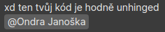

Hey there, person who wants to give me a job. You came to the right place.

I'm rather proficient in Python and LaTeX, right now I'm learning C#, TS, Svelte…

Review by @JindrazPrahy :


<!---
```
          ┌────────┐
    ┌─────┤It could◄─────┐
    │     │be worse│     │
    │     └────────┘     │
┌───▼────┐          ┌────┴───┐
|It could│          │It could│
│be worse│          │be worse│
└───┬────┘          └────▲───┘
    │     ┌────────┐     │
    │     │It could│     │
    └─────►be worse├─────┘
          └────────┘
```


Quacken8/Quacken8 is a ✨ special ✨ repository because its `README.md` (this file) appears on your GitHub profile.
You can click the Preview link to take a look at your changes.
--->
